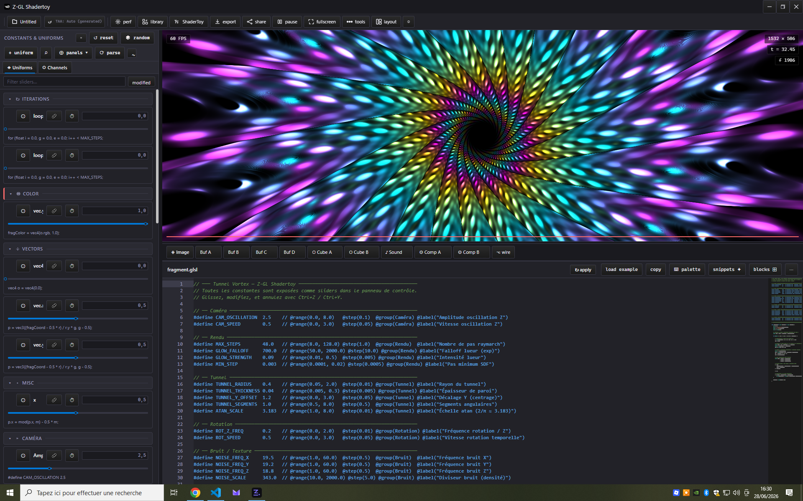

<p align="center">
  
</p>

<h1 align="center">Z-GL Shadertoy</h1>

<p align="center">
  <strong>Real-time Shadertoy shader editor — 100% offline, no account, no cloud.</strong><br>
  For generative artists, graphics researchers, and anyone who writes shaders.
</p>

<p align="center">
  
  
</p>

<p align="center">
  
</p>

---

## What is Z-GL Shadertoy?

Z-GL Shadertoy is a desktop GLSL shader editor built entirely around the Shadertoy format. Write a `mainImage` function, use the standard uniforms (`iTime`, `iResolution`, `iMouse`, `iChannel0–3`…), wire up Buffer A–D / Cube / Sound passes, and import or export directly to/from shadertoy.com — no internet connection required, no WebAssembly, no account.

---

## Features

### Editor

- **Monaco editor** — GLSL syntax highlighting, autocomplete, hover documentation, live error markers, minimap
- **Automatic sliders** — every top-level `#define` or `const float/int` becomes a draggable slider with undo/redo (Ctrl+Z / Ctrl+Y)
- **Live `#define` annotations** — slider values are shown inline in the editor when they differ from the code
- **Snippet library** — categorized collection of ready-to-insert GLSL functions (noise, SDF, lighting, color, math, texturing)
- **Right-click code actions** — extract any selection as a reusable snippet, auto-generate a comment header for a function
- **Autocomplete from your library** — all your saved snippets appear in the editor's autocomplete suggestions
- **Version history** — significant edits are saved automatically and can be restored from the Version History panel
- **Command palette** — `Ctrl+,` to open Settings, `Ctrl+Shift+P` for all actions

### Full Shadertoy rendering

- **Multipass** — Image, Buffer A–D (with inter-frame feedback), Cube A–F, and Sound passes
- **All standard uniforms** — `iResolution`, `iTime`, `iTimeDelta`, `iFrame`, `iMouse`, `iDate`, `iSampleRate`, `iChannel0–3`, `iChannelResolution`
- **All channel types** — static image, video, webcam, audio/mic (FFT), cubemap, previous frame (feedback), keyboard texture, procedural noise

### Post-process effects

- **Style layers** — stackable effects with per-layer blend mode and opacity: glitch, chromatic aberration, vignette, lens distortion, ASCII art, and more
- **LUT color grading** — built-in LUT library + 1D curve editor + `.cube` file import (3D LUT)
- **Colorblindness simulation** — Protanopia / Deuteranopia / Tritanopia as a live post-pass (`Ctrl+Shift+B`)
- **WCAG contrast warning** — flags color combinations in your render that fail accessibility contrast thresholds
- **UV warp effects** — camera shake, dolly zoom (Vertigo effect), and more, injectable directly into `mainImage`

### Colors & themes

- **Inline HSL color picker** — click any `vec3(r, g, b)` in the editor to open a color picker and edit in place
- **IQ cosine palette** — one-click insertion of an Inigo Quilez palette snippet with your current values
- **Custom themes** — save any combination of slider values + color palette as a named theme
- **Theme interpolation** — smoothly blend between two themes
- **Auto accent color** — extract the dominant color from the render and apply it to the UI automatically

### 3D Camera

- **Camera panel** — position XYZ, target, FOV, near/far, all as sliders
- **Presets** — Front, Top, Side, Isometric, 35mm cinematic, Wide 90°
- **Keyframes** — record camera positions and play them back with smooth easing
- **Fly mode** — navigate freely with WASD + Q/E
- **XYZ gizmo** — clickable axis indicator in the viewport corner for instant view snapping
- **Pick tool** — click anywhere on the canvas to read the UV coordinate at that point
- **Automatic uniforms** — `iCameraPos`, `iCameraTarget`, and `iCameraFov` are passed to your shader automatically

### Raymarching & SDF tools

- **Raymarching wizard** — generate a complete raymarching shader in one click: camera, SDF scene, normals, soft shadows, ambient occlusion, shading
- **Extend existing raymarchers** — auto-detect what's already in your shader and inject only the missing parts (normals, soft shadows, AO)
- **PBR materials** — inject Metallic/Roughness (GGX), Subsurface Scattering, or Iridescence shaders in one click
- **SDF Library + Composer** — 35+ SDF primitives, boolean operations (smooth union, intersection, subtraction, morph), visual scene composer
- **SDF Visualizer** — iso-distance heatmap, field view, normal visualization, and step count overlay
- **Parameter tuning panel** — live `MAX_STEPS`, `MAX_DIST`, `SURF_DIST` sliders with instant shader update

### SDF shapes

- **Shape panel** — combine 2D/3D SDF shapes with feather, invert, and 2.5D extrude
- **Custom Bézier shapes** — draw curves with an interactive editor
- **SVG import** — paste an SVG path and convert it to an SDF mask automatically
- **Time-driven animation** — shapes can rotate, pulse, or morph using `iTime`

### Import / Export

- **ZIP import** — drag and drop a `.zip` export from shadertoy.com; all passes are detected and reconstructed automatically
- **shadertoy.com export** — cleans local uniform/precision declarations for direct paste into the shadertoy.com editor
- **Full export** — PNG screenshot, MP4/WebM video, raw or minified GLSL, Three.js snippet, standalone HTML page, `.zgl` project ZIP, p5.js sketch, GLSL Sandbox format
- **Share link** — encodes the shader and slider values into a compressed URL, including multipass shaders

### Native desktop (Windows)

- Borderless window with custom titlebar and Mica/Acrylic effect
- System tray icon, recent files list (MRU)
- Native file dialogs, drag & drop, `.glsl`/`.frag` file association
- External file watch — edit in VS Code, Neovim, or any editor and preview live
- Auto-save with crash recovery

### Accessibility & customization

- **9 built-in languages** — EN, FR, DE, JA, ZH, PT-BR, ES, RU, KO — no network calls
- **Themes** — multiple built-in themes + Settings panel
- **Modulation** — LFO, noise, audio-reactive, random, and envelope sources to drive any parameter dynamically

### Headless rendering (CLI)

```bash
z-gl --headless --shader plasma.frag --out plasma.png
z-gl --headless --help
```

---

## Who is it for?

- Generative artists who write or collect Shadertoy shaders
- Developers who want a fast, local Shadertoy editor without a browser
- Graphics researchers who need to iterate on GLSL without a cloud dependency

---

## Compatibility

- **Platform** — Windows (native desktop via Tauri) or any modern browser (Chrome, Edge, Firefox)
- **No internet required** — everything works offline
- **No WebAssembly** — the entire render, export, and analysis pipeline is native JavaScript/GLSL

---

See [CHANGELOG.md](./CHANGELOG.md) for the full version history.
